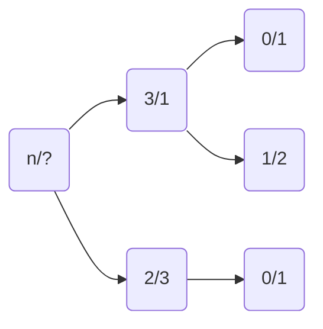

# 动态规划
## 动态规划的主要做题步骤
- 确定dp数组（dp table）以及下标的含义
- 确定递推公式
- dp数组如何初始化
- 确定遍历顺序
- 举例推导dp数组
## 01背包问题
相关题 416

## 从记忆化搜索到递推
### 从打家劫舍开始
某一些动态规划问题，都可以归纳为，在某一步中选与不选，那么就可以进一步通过回溯的方式缩小问题的规模，然后进一步总结为递推问题，比如说198打家劫舍问题，
假设各家的钱财如下表所示
|0|1|2|3|
|---|---|---|---|
|1|2|3|1|

如果从后往前挑，2、3号房只能选其中一个，这时问题的规模会继续缩减，假设在选了三号房的基础上，就只能选0或者1号房，在选择2号房的基础上，就只能选择0号房，在这些所有的可能路径中，最大的路线就是选择2号房再选择0号房。

那么，这就是一个回溯的过程，是一个dfs的过程，写下代码为
```cpp
int dfs(vector<int> nums, int n)
{
    if (n <= 0)
    {
        return 0;
    }
    // 返回条件即为，如果选第n个节点，则当前的最大金额就是前n-2个节点的总金额
    // 如果不选第n个节点，则当前最大金额就是前n-1个节点的总金额
    // 则当前节点的最大金额就是这两种方式获取的最大金额，
    // 按照这种方式不断向前去迭代
    return max(dfs(nums, n - 1), dfs(nums, n - 2) + nums[n]);
}

int rob(vector<int> nums)
{
    return dfs(nums, nums.size() - 1);
}

```
上面这种方式是递归的过程，递归过程的时间复杂度是指数级别的，因为每一个i都会生成2个子节点，每个子节点会继续生成对应的2个子节点，一共有n个节点，所以时间复杂度是 $o(2^n)$

上述计算过程会对某些结果进行重复计算， 如果能够使用一个hash表存储计算过程的结果，这样就能省去重复计算浪费的时间，代码如下
```cpp
int rob_mem(vector<int> nums)
{
    int n = nums.size();
    // 记忆以前递归过的位置，使用数组作为hash表。
    // -1表示之前没有递归过
    vector<int> mem(n, -1);
    // 使用lambda表达式将递归函数定义在函数体内部
    function<int(int)> dfs = [&](int i) -> int
    {
        if (i < 0)
            return 0;
        if (mem[i] != -1)
            return mem[i];
        mem[i] = max(dfs(i - 1), dfs(i) + nums[i]);
        return mem[i];
    };
    return dfs(n - 1);
}
```
在记忆化搜索中，是通过递归的方式，从后往前搜索，如果能从前往后递推，那么就能进一步的减少出栈入栈的时间，那么如何从前往后递推呢，从递归的函数调用的情况来看，如下所示
$$
dfs(i)=max(dfs(i-1), dfs(i-2)+nums[i])
$$
那么想要从前往后推，即知道dfs(i-1)和dfs(i-2)的值便可推出dfs(i)的值，所以就把函数调用改成数组，这样其实就写出了动态规划的状态转移方程
$$
f[i] = max(f[i-1], f[i-2]+nums[i])
$$
为了防止数组越界的问题，可以将循环从i=2开始，或者直接扩大数组的大小为n+2,并将初始两个初始化为0，代码如下
```cpp
int rob_dp(vector<int> nums)
{
    int n = nums.size();
    vector<int> f(n + 2, 0);
    for (int i = 2; i < n + 2; ++i)
    {
        f[i] = max(f[i - 1], f[i - 2] + nums[i - 2]);
    }
    return f[n - 1 + 2];
}
```
其实在这个过程中，没必要存储所有的递推数组的结果，所以可以采用滚动变量的方式，降低代码的空间复杂度, 代码如下
```cpp
int rob_dp_opt(vector<int> nums)
{
    int n = nums.size();
    int f0 = 0, f1 = 0;
    for (int i = 0; i < n; ++i)
    {
        int f2 = max(f1, f0 + nums[i]);
        f0 = f1;
        f1 = f2;
    }
    return f1;
}
```
